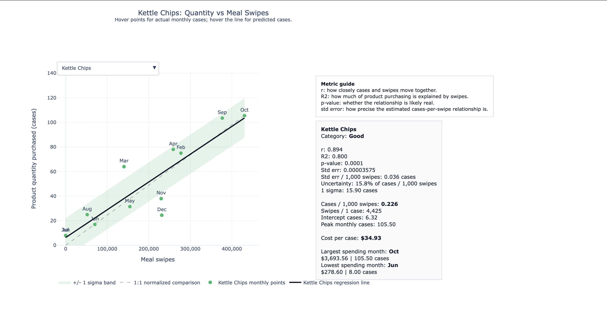
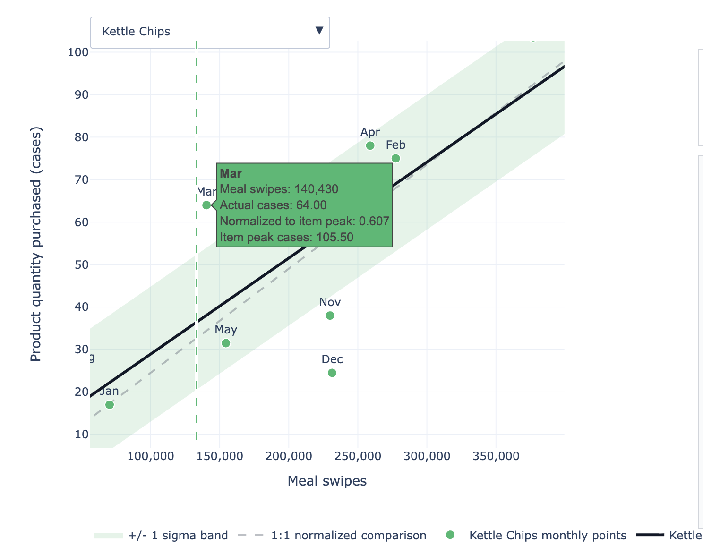
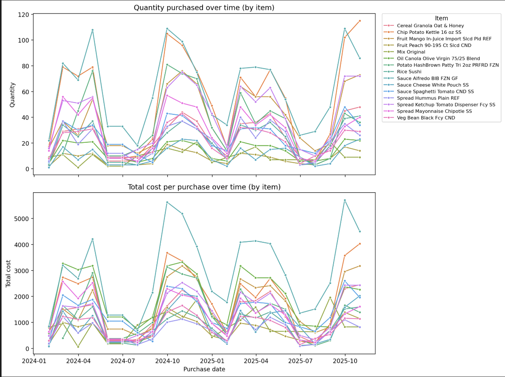
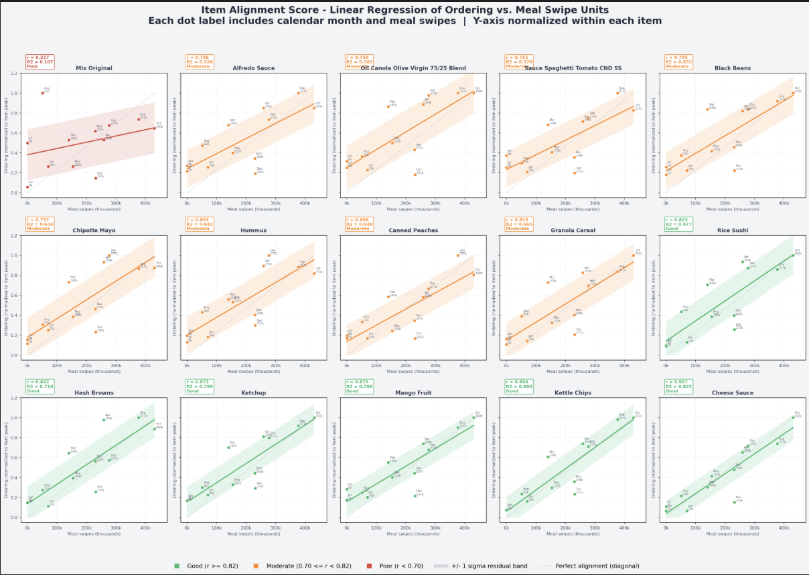

# Dining Services Cost and Demand Modeling

This project uses real dining services data from my school to analyze non-perishable purchasing patterns alongside meal swipe activity. I built this modeling work for my school's dining services team to help identify demand patterns, reduce unnecessary purchasing, and support lower operating costs.

The analysis combines purchasing data from `A.5_Non-Perishables.xlsx` with meal plan usage data, then produces summary tables, regression diagnostics, forecasts, and publication-ready charts that show how food demand, item ordering, and cost behavior move over time.

At a high level, the analysis asks:

- Which non-perishable items are purchased most often?
- How do total weekly costs and per-unit costs change over time?
- How closely do item order quantities align with meal swipe demand?
- How strongly are monthly meal swipes related to overall quantity purchased?
- What would meal swipe demand look like under a simple forward forecast and headcount-growth assumption?

## Project Structure

- `Econ_proj.py` is the main analysis pipeline.
- `per_unit.py` and `dupe_check.py` are supporting scripts for narrower data checks.
- `A.5_Non-Perishables.xlsx` is the source workbook used by the default run.
- `requirements.txt` pins the Python dependencies needed to reproduce the analysis.
- Output files are written directly into the project folder as `.csv`, `.txt`, `.png`, and `.html` artifacts.

## Analysis Outputs

The generated outputs fall into four broad groups:

- Purchasing frequency and cost tracking:
  `item_purchase_counts.csv`, `weekly_total_cost.csv`, `weekly_costs.png`, `cost_per_unit_per_purchase.csv`, `cost_per_unit_over_time.png`, `total_cost_per_item_over_time.png`

- Meal swipe demand and forecasts:
  `meal_swipes_per_month.csv`, `meal_swipes_per_month.png`, `meal_swipes_demand_index_by_calendar_month.csv`, `meal_swipes_forecast_2024_2025.csv`, `meal_swipes_forecast_yearly_summary.csv`, `meal_swipes_actual_vs_forecast.png`

- Regression and diagnostic results:
  `meal_swipes_vs_quantity_regression.txt`, `meal_swipes_vs_quantity_regression_diagnostics.csv`, `meal_swipes_vs_quantity_regression_nonzero_swipes.txt`, `meal_swipes_vs_quantity.png`, `meal_swipes_vs_quantity_outlier_diagnostic.png`, `meal_swipes_vs_headcount_regression.txt`, `meal_swipes_vs_headcount.png`, `meal_swipes_headcount_4pct_impact.txt`

- Item-level demand alignment:
  `item_meal_swipe_unit_regression.csv`, `item_monthly_quantity_by_meal_swipes.csv`, `item_alignment_scores.csv`, `item_alignment_score_regression.png`, `item_meal_swipe_interactive_regression.html`

## Visual Examples

The interactive item-level regression view helps compare monthly item purchasing against meal swipe demand. The examples below show the Kettle Chips view, including the metric guide, hover tooltip, regression line, normalized comparison line, and uncertainty band.









## Method Overview

The pipeline starts by cleaning and standardizing item IDs and item names. It then aggregates purchasing activity by item, calendar week, purchase date, and month. Meal swipe totals are extracted from the meal plan sheet, collapsed into monthly demand measures, and compared against purchasing quantities.

The regression sections evaluate relationships between meal swipes, headcount, and purchased quantity. The item-level alignment section scores how well each item's ordering pattern tracks monthly meal swipe demand, helping identify products whose purchases rise and fall with dining activity.

Forecasting is intentionally simple and transparent: the script copies the latest observed monthly meal swipe pattern forward and applies a 4 percent annual growth assumption for headcount-oriented demand planning.

## How To Run

Create a virtual environment and install dependencies:

```bash
python3 -m venv .venv
source .venv/bin/activate
pip install -r requirements.txt
```

Run the main analysis:

```bash
python3 Econ_proj.py
```

By default, the script reads `A.5_Non-Perishables.xlsx` and uses the `Data` sheet. A different workbook and sheet can be supplied from the command line:

```bash
python3 Econ_proj.py path/to/file.xlsx "Data"
```

## Notes

This is not a synthetic example or toy dataset. The project is based on real operational dining data and was created to support practical cost-reduction work for my school's dining services.

The analysis is designed as a reproducible project snapshot: source data, code, dependency versions, and generated outputs live together so the charts and tables can be regenerated from the same inputs.
